# 🔬 JA(4+) - Identifying Malicious Anomalies in Encrypted Network Traffic

**By: Sharon Vilensky**

> In the past, security systems could inspect the content of network traffic. Today, with the vast majority of global traffic encrypted (TLS/SSL), this capability is nearly gone. This article describes the JA4+ suite of signatures, which allows us to confront the growing threat of sophisticated attackers using encrypted communication. We will use the **Malcolm** tool to analyze malicious and encrypted network traffic in the examples provided.

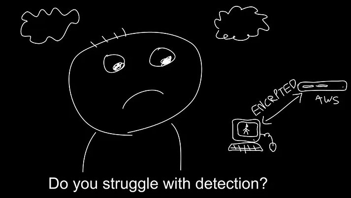

---

## TL;DR (Too Long; Didn't Read)

This guide teaches you how to hunt for malicious actors in encrypted network traffic.

* **The Problem**: Most network traffic is encrypted (TLS/SSL), making it a blind spot for security monitoring. Attackers hide their activities inside this encrypted traffic.
* **The Old Solution (JA3)**: A method to fingerprint TLS clients. It's useful but easy for attackers to fake (impersonate) and can be unreliable.
* **The New Solution (JA4+ Suite)**: A much more powerful set of fingerprints for not just TLS, but also TCP, HTTP, and certificates. This creates a multi-dimensional view of network behavior, making it harder for attackers to hide.
* **What You'll Learn**: Through hands-on examples with real malware PCAPs (EMOTET, Cobalt Strike), you will learn to use tools like Wireshark and Malcolm to move from hunting for static **Indicators of Compromise (IoCs)** to proactive, behavior-based **Indicators of Attack (IoAs)** using the JA4+ suite.

---

## 🚀 Why Read This Guide?

This guide is a comprehensive, hands-on journey into the world of modern network threat hunting. By completing it, you will move beyond basic artifact matching and learn to dissect complex, encrypted traffic to uncover sophisticated threats.

### You Will Master These Concepts:
* ✅ **Indicators of Compromise (IoCs)**: Understand how to use static artifacts like malicious IP addresses, domains, and file hashes for initial investigation.
* ✅ **Indicators of Attack (IoAs)**: Learn the powerful technique of identifying threats by their *behavior*—how they act on the network, regardless of their infrastructure.
* ✅ **TLS/JA3/JA4+ Fingerprinting**: Go from theory to practice in identifying clients and applications based on their unique network fingerprints—a core IoA.
* ✅ **Multi-Dimensional Analysis**: Combine JA4T, JA4H, and JA4X signatures to build high-fidelity IoAs that expose threats across multiple protocol layers.

### You Will Use These Tools:
* 🛠️ **Wireshark & `tshark`**: Use industry-standard tools for manual packet inspection and command-line analysis to extract critical evidence.
* 🛠️ **RITA**: Automate the detection of C2 beaconing—a key IoA—by analyzing Zeek logs for suspicious, repetitive communication patterns.
* 🛠️ **The Malcolm Suite**: Leverage a powerful, integrated NTA platform, using **Zeek** for metadata, **Suricata** for alerts, and **Arkime** for full-packet investigation.
* 🛠️ **Arkime Query Language**: Use Arkime's powerful search syntax to combine multiple JA4+ fingerprints and other metadata into a single, effective hunt.

### You Will Gain These Capabilities:
* 🎯 **Hunt for Static IoCs**: Effectively use known-bad lists to find initial footholds and confirmed malicious activity in network traffic.
* 🎯 **Transition from IoC to IoA Hunting**: Evolve your skills from reactive artifact hunting to proactively identifying attacker TTPs before IoCs are even generated.
* 🎯 **Deconstruct Real-World Attacks**: Analyze the full attack chain of threats like **EMOTET with Cobalt Strike** and a **Microsoft Teams Phishing Campaign**.
* 🎯 **Unmask Evasive Malware & Build High-Fidelity Hunt Queries**: Identify disguised threats and write powerful, multi-faceted queries to find malicious activity with minimal false positives.

---

### How Malcolm Empowers Your Hunt

The TL;DR explained the problem of encrypted traffic. Here’s a visual representation of how a Network Traffic Analysis (NTA) platform like Malcolm turns raw, confusing data into clear, actionable intelligence.

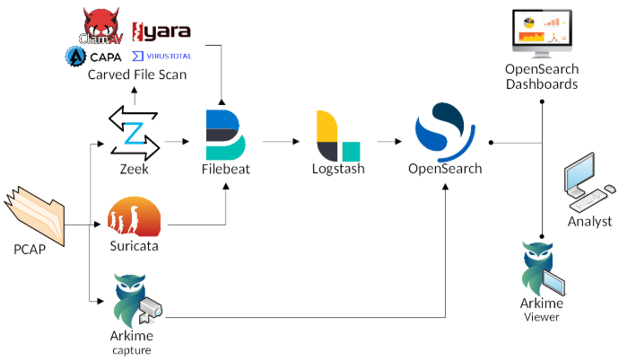

---

## 📜 Table of Contents

1.  [📦 **Sample PCAPs Used in This Guide**](#-sample-pcaps-used-in-this-guide)
2.  [💡 **Part 1: Theoretical Foundation**](#-part-1-theoretical-foundation)
    * [The Challenge of Encrypted Traffic](#the-challenge-of-encrypted-traffic)
    * [What is TLS and JA3/S?](#what-is-tls-and-ja3s)
    * [Weaknesses of JA3](#️-weaknesses-of-ja3)
    * [JA3 vs. JA4+ - The Next Generation](#-ja3-vs-ja4---the-next-generation)
    * [The JA4+ Suite](#the-ja4-suite)
3.  [🕵️ **Part 2: Hands-On with JA3 (EMOTET & Cobalt Strike)**](#️-part-2-hands-on-with-ja3-emotet--cobalt-strike)
    * [Identifying Malicious Traffic with JA3 IoCs](#identifying-malicious-traffic-with-ja3-iocs)
    * [Basic PCAP Analysis: Identifying Beaconing](#basic-pcap-analysis-identifying-beaconing)
    * [Beacon Analysis with RITA](#beacon-analysis-with-rita)
    * [Certificate Anomaly Analysis](#certificate-anomaly-analysis)
4.  [🖥️ **Part 3: Hands-On with Malcolm (EMOTET Mail Spam)**](#️-part-3-hands-on-with-malcolm-emotet-mail-spam)
    * [Advanced PCAP Analysis with Malcolm](#advanced-pcap-analysis-with-malcolm)
    * [Investigating with Zeek, Suricata, and Arkime](#investigating-with-zeek-suricata-and-arkime)
    * [Identifying Anomalies in Dashboards](#identifying-anomalies-in-dashboards)
5.  [🚀 **Part 4: Advanced Hunting with JA4+**](#-part-4-advanced-hunting-with-ja4)
    * [Example: Hunting an Unknown JA4T Signature (Pi Node Miner)](#example-hunting-an-unknown-ja4t-signature-pi-node-miner)
    * [Hands-On: Microsoft Teams Phishing Campaign](#hands-on-microsoft-teams-phishing-campaign)
    * [Hunting with JA4H (HTTP)](#hunting-with-ja4h-http)
    * [Hunting with JA4X (Certificates)](#hunting-with-ja4x-certificates)
    * [Combining Signatures for High-Fidelity Detection](#combining-signatures-for-high-fidelity-detection)
6.  [✅ **Conclusion**](#-conclusion)

---

## 📦 Sample PCAPs Used in This Guide

To follow along with the hands-on examples, you can download the malicious packet captures from their original source at [Malware-Traffic-Analysis.net](https://www.malware-traffic-analysis.net/).

* **Part 2 (JA3 Hunt)**: **EMOTET with Cobalt Strike**
    * **Source**: [2022-03-24 - Emotet Epoch 4 with Cobalt Strike](https://www.malware-traffic-analysis.net/2022/03/24/index.html)
    * **File**: `2022-03-24-Emotet-epoch4-with-Cobalt-Strike-carved.pcap`

* **Part 3 (Malcolm Hunt)**: **EMOTET Mail Spam**
    * **Source**: [2022-04-20 - Emotet Epoch 4 Infection with Cobalt Strike](https://www.malware-traffic-analysis.net/2022/04/20/index.html)
    * **File**: `2022-04-20-Emotet-epoch4-infection-with-spambot-traffic.pcap`

* **Part 4 (JA4+ Hunt)**: **Microsoft Teams Phishing**
    * **Source**: [2023-01-25 - Fake Microsoft Teams Update Page](https://www.malware-traffic-analysis.net/2023/01/25/index.html)
    * **File**: `2023-01-25-Fake-Microsoft-Teams-update-page-delivers-malware.pcap`

---

## 💡 Part 1: Theoretical Foundation

### The Challenge of Encrypted Traffic

Most internet communication is encrypted using TLS/SSL protocols. While essential for privacy, this creates a significant challenge for security teams. Attackers exploit encrypted channels to hide their activities, forcing us to shift our focus from **what** (the data, files, commands) to **how** and **who** (the metadata of the communication).

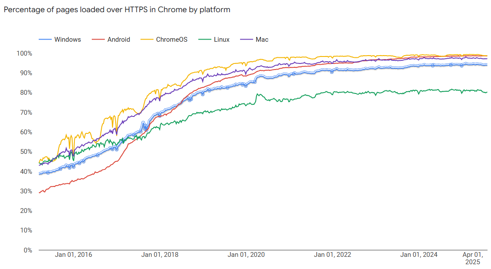

According to Google, the use of HTTPS is constantly rising, and Zscaler found that over 87% of online threats are hidden in encrypted traffic. This is where JA3 and its successor, JA4+, come into play.

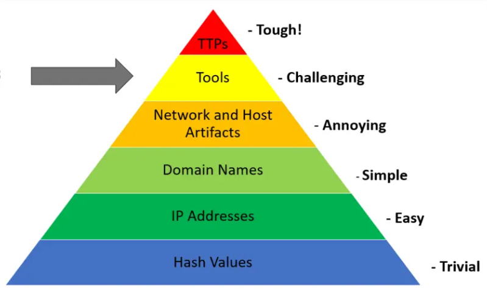

### What is TLS and JA3/S?

The TLS protocol establishes a secure connection through a handshake process. The initial steps, `Client Hello` and `Server Hello`, are sent in plaintext.

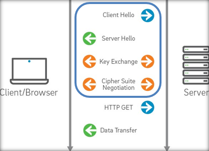

JA3, an algorithm developed by Salesforce, creates a fingerprint (an MD5 hash) of the plaintext fields in the `Client Hello` packet. This allows us to identify the client-side application initiating the connection.

* `JA3`: Fingerprints the **client's** `Client Hello`.
* `JA3S`: Fingerprints the **server's** `Server Hello`.

By combining `JA3` and `JA3S`, we can precisely identify a specific client-server communication. For example, a generic Python client (`JA3`) communicating with a known Cobalt Strike C2 server (`JA3S`) becomes a high-confidence indicator of malicious activity.

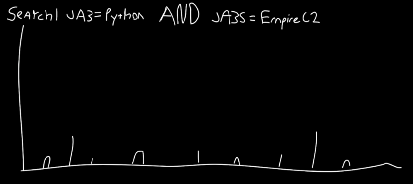

| Example Type | Application | JA3 / JA3S Fingerprint                                       |
| :----------- | :---------- | :----------------------------------------------------------- |
| **Legitimate** | Tor Browser | `JA3: e7d705a3286e19ea42f587b344ee6865` / `JA3S: a95ca7eab4d47d051a5cd4fb7b6005dc` |
| **Malicious** | Trickbot    | `JA3: 6734f37431670b3ab4292b8f60f29984` / `JA3S: 623de93db17d313345d7ea481e7443cf` |
| **Malicious** | Emotet      | `JA3: 4d7a28d6f2263ed61de88ca66eb011e3` / `JA3S: 80b3a14bccc8598a1f3bbe83e71f735f` |

### ⚠️ Weaknesses of JA3

While powerful, JA3 has significant weaknesses:

1.  **GREASE Protocol**: Modern browsers like Chrome randomize TLS extensions (a technique called GREASE) to prevent ossification. This causes a single application to generate many different JA3 hashes, reducing detection effectiveness.
2.  **JA3 Impersonation**: Attackers can easily modify their TLS client to mimic the JA3 fingerprint of a legitimate application (like Chrome or Firefox), allowing them to blend in and evade detection.
3.  **Collisions**: Different applications can sometimes produce the same JA3 hash, leading to false positives.

---

### 🚀 JA3 vs. JA4+ - The Next Generation

To address the shortcomings of JA3, FoxIO developed the **JA4+** suite. The goal was to create stronger, more readable, and multi-dimensional fingerprints across various protocols.

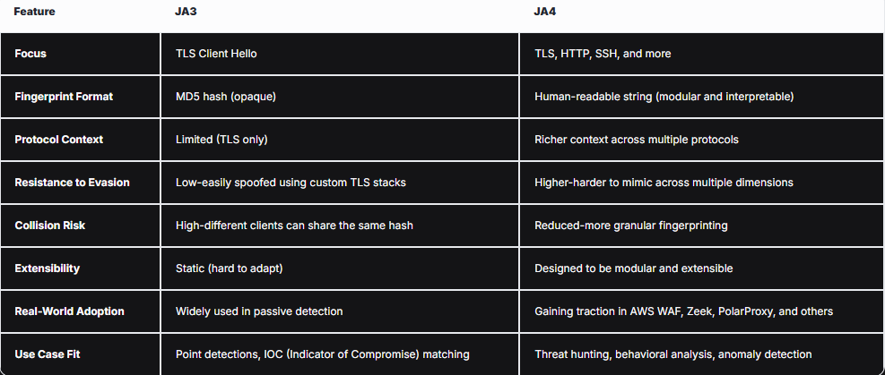

### The JA4+ Suite

JA4+ is a collection of signatures for different aspects of a connection:

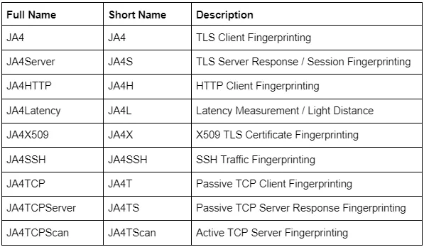

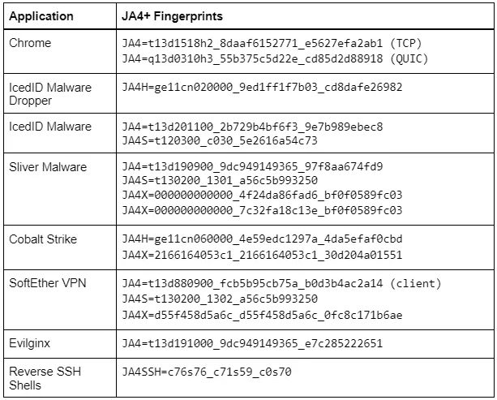

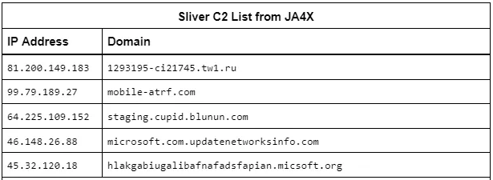

Unlike JA3's MD5 hash, JA4+ signatures are human-readable strings. For example, a **JA4T (TCP)** signature looks like this:

`JA4T=65535_2-1-3-1-1-4_1460_8`

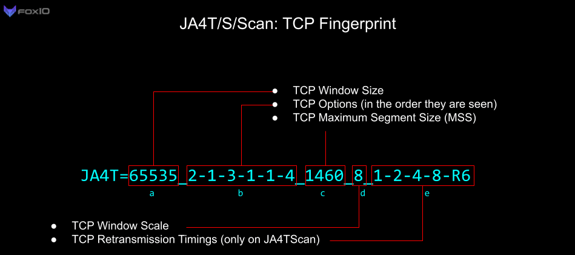

This can be broken down:

* `65535`: TCP Window Size
* `2-1-3-1-1-4`: TCP Options (in order)
* `1460`: TCP Maximum Segment Size (MSS)
* `8`: TCP Window Scale

This modularity allows for much more nuanced and resilient threat hunting.

---

## 🕵️ Part 2: Hands-On with JA3 (EMOTET & Cobalt Strike)

### Identifying Malicious Traffic with JA3 IoCs

In this scenario, we analyze a PCAP where 82% of the traffic is TLS.

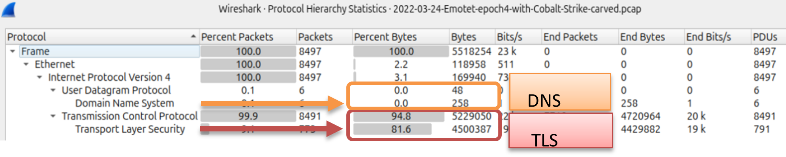

**1. Extract JA3 Hashes and IPs:**
Using `tshark`, we can extract the unique JA3 fingerprints and their corresponding destination IPs. The command aggregates the counts of each unique JA3 hash and the destination IP it communicates with.

```bash
# Example tshark command to extract JA3 and destination IP
tshark -r capture.pcap -Y "tls.handshake.type == 1" -T fields -e tls.ja3 -e ip.dst | sort | uniq -c
```

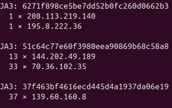

**2. Check Against Threat Intelligence:**
We take the IPs and JA3 hashes and check them against IoC databases like Abuse.ch's ThreatFox and VirusTotal. The high frequency of connections to certain IPs, combined with known malicious JA3 hashes, quickly reveals the C2 servers.

* **IP**: `139.60.160.8` -> Known Cobalt Strike C2
* **JA3**: `37f463bf4616ecd445d4a1937da06e19` -> Associated with Cobalt Strike

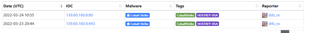
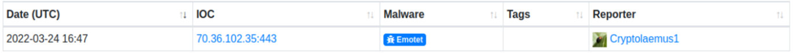
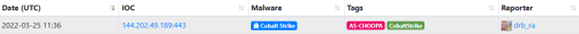

### Basic PCAP Analysis: Identifying Beaconing

By filtering the traffic in Wireshark to a specific C2 IP (`139.60.160.8`), we observe a pattern characteristic of C2 beaconing:

* **Regular Intervals**: Connections occur every ~11 seconds.
* **Consistent Size**: Each communication transfers a small, fixed amount of data.
* **One-Way Traffic**: Data flows primarily from the infected host to the C2 server.

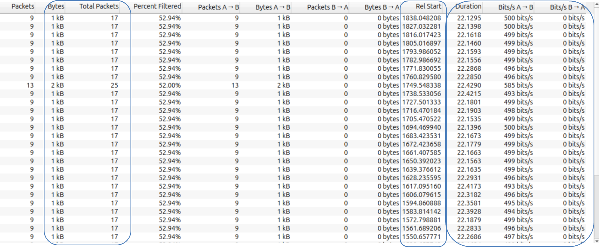

### Beacon Analysis with RITA

We can automate beacon detection using RITA (Real Intelligence Threat Analytics), which analyzes Zeek logs. RITA scores connections based on the likelihood of beaconing behavior. In our analysis, RITA flagged the connection to `verofes.com` (the domain for our C2 IP) with a 62.5% confidence score for beaconing, confirming our manual analysis.

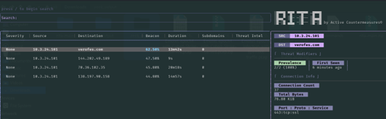

### Certificate Anomaly Analysis

Attackers often use self-signed or fraudulent certificates. We can hunt for anomalies in two ways:

1.  **Blacklist-based**: Check certificate details against known-bad databases like ThreatView.io's list of Cobalt Strike C2 certificates.
2.  **Lead-based**: Manually inspect certificate fields for suspicious values.

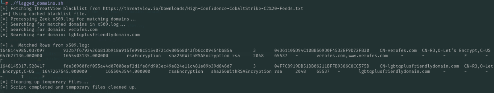

In our PCAP, we found a certificate for `verofes.com` with a suspicious `CommonName` of `example.com`, and another certificate for `lgbtqplusfriendlydomain.com` which is a known Cobalt Strike IoC.

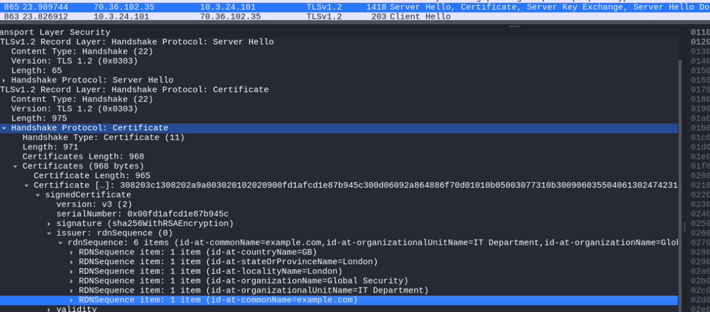

---

## 🖥️ Part 3: Hands-On with Malcolm (EMOTET Mail Spam)

### Advanced PCAP Analysis with Malcolm

Malcolm is a powerful, open-source **Network Traffic Analysis (NTA)** tool suite. Its strength lies in integrating several best-in-class tools into a single, cohesive platform, allowing analysts to seamlessly pivot between different views of the data.

| Malcolm Component | Role & Strength                                                                                                     |
| :---------------- | :------------------------------------------------------------------------------------------------------------------ |
| **Zeek** | The primary **metadata generator**. Zeek inspects raw traffic and produces high-fidelity, structured logs for dozens of protocols (HTTP, DNS, SSL/TLS, etc.). This turns raw packets into easily searchable events. |
| **Suricata** | A high-performance **Intrusion Detection System (IDS)**. Suricata matches traffic against a vast repository of known-bad signatures (rulesets like ET Open) to generate alerts for malware, exploits, and policy violations. |
| **Arkime** | The **full packet capture (FPC)** indexer and viewer. Often called "Wireshark on steroids," Arkime captures and indexes every packet, providing a powerful interface to search, filter, and visualize sessions, and to download the raw PCAP for deep-dive analysis. |
| **OpenSearch** | The **data storage and search engine**. All logs from Zeek and alerts from Suricata are sent to OpenSearch, which provides fast, scalable search and aggregation capabilities, powering all of Malcolm's dashboards. |

We start our investigation in the main **Overview Dashboard**.

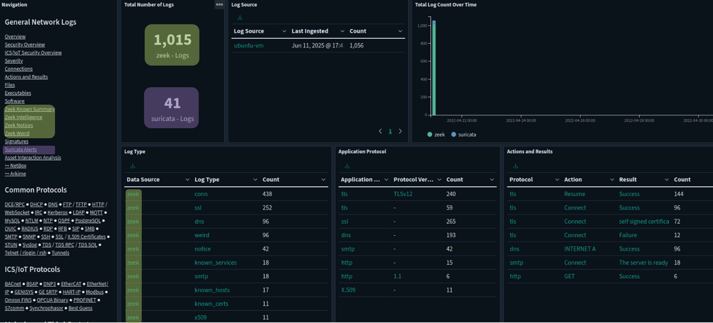

### Investigating with Zeek, Suricata, and Arkime

**1. Start with Alerts:**
We move to the **Suricata Alerts** dashboard. We immediately see high-confidence alerts:

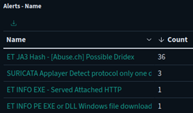

* `ET JA3 Hash - [Abuse.ch] Possible Dridex`: 36 hits, pointing to known malicious JA3 fingerprints.
* `ET INFO PE EXE or DLL Windows file download`: Indicates a malicious file was downloaded.

**2. Pivot to Arkime:**
Clicking on an alert in Malcolm pivots us directly into the **Arkime** interface, which provides a detailed view of all related sessions. Here, we can see the full context: the source/destination IPs, ports, protocols, and all related Zeek logs and Suricata alerts for that specific communication.

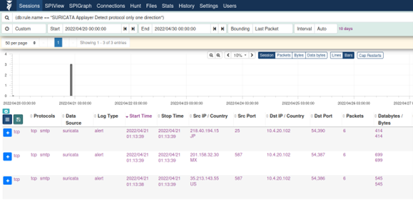

### Identifying Anomalies in Dashboards

Malcolm's dashboards allow for rapid anomaly detection:

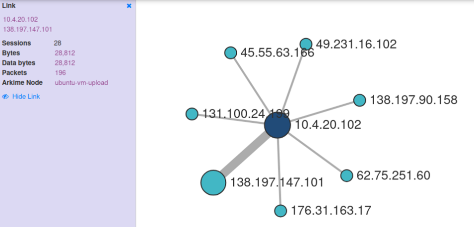
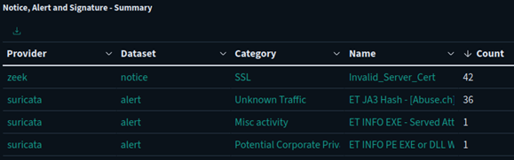
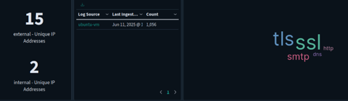
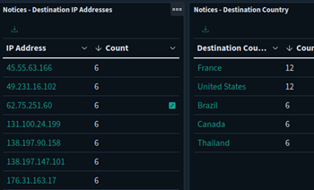
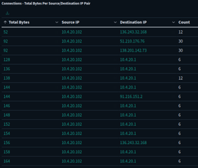
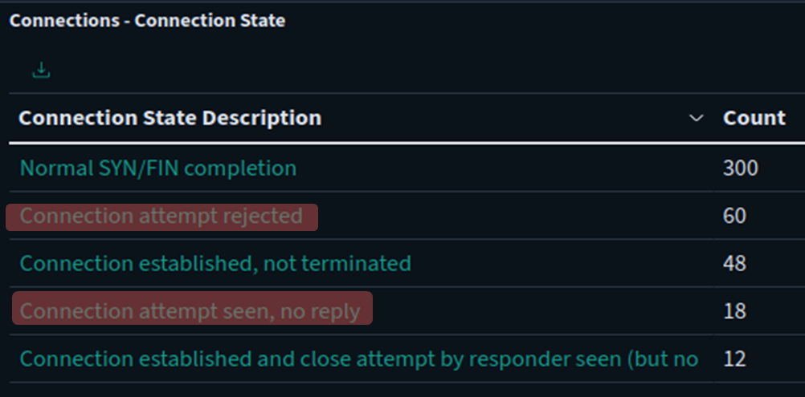
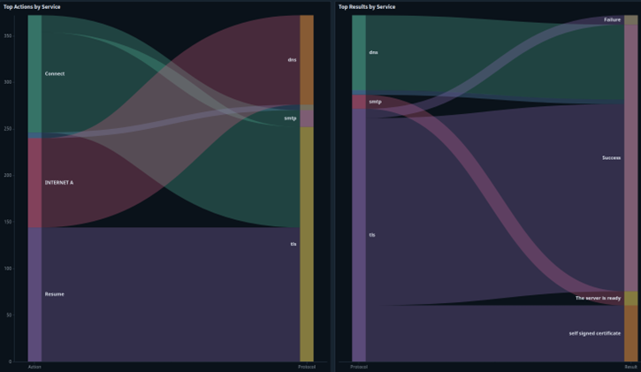
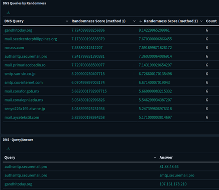

---

## 🚀 Part 4: Advanced Hunting with JA4+

### Example: Hunting an Unknown JA4T Signature (Pi Node Miner)

This real-world example demonstrates hunting based on a high-frequency, unknown JA4T signature.

**1. The Anomaly:**
A JA4T signature, `29200_2-4-8-1-3_1424_7`, appeared with very high frequency, mostly communicating over port 22 (SSH). This signature was not in any known database.

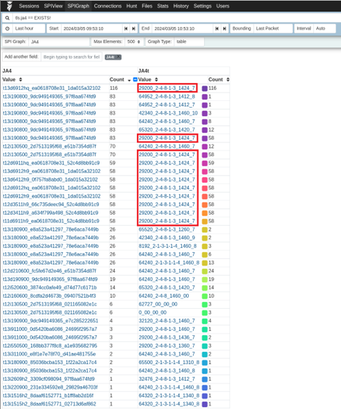

**2. Deconstructing the JA4T:**

* `2-4-8-1-3`: The TCP options indicate a **Unix-based** OS.
* `1424`: The MSS (Maximum Segment Size) is unusual. A standard MSS is 1460. The smaller size suggests a VPN or tunnel is in use.
* `29200`: The TCP Window size is also non-standard for typical clients.

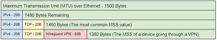

**3. The Discovery:**
Analysis revealed this signature belongs to the **Pi Node** application, a cryptocurrency miner. Attackers were using the Pi network as a proxy to tunnel their malicious SSH traffic, effectively masking their C2 communications within the "legitimate" mining traffic.

**4. The Hunt:**
By combining this JA4T with other JA4+ signatures, a high-fidelity detection was created:

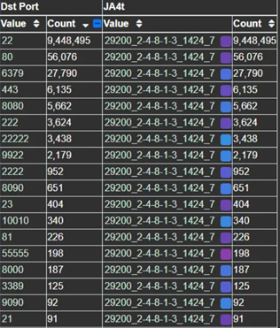
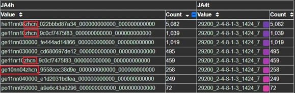
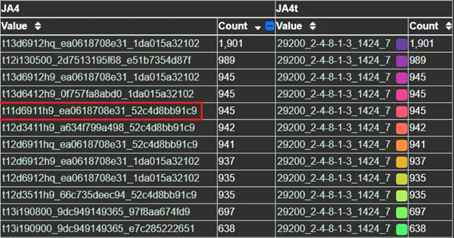

* **JA4T + Destination Port**: Block or alert on this JA4T when the destination is port 22, but not when it's the legitimate Pi Node port (31400), reducing false positives.
* **JA4T + JA4H**: When this traffic was seen over port 80 (HTTP), the JA4H signature revealed a `User-Agent` trying to mimic Chinese users (`zhcn`), a common bot tactic.

This case shows how a single, unknown JA4T signature can be the starting point for uncovering a sophisticated evasion technique.

### Hands-On: Microsoft Teams Phishing Campaign

In this advanced scenario, we hunt for a threat that uses a fake Microsoft Teams page to deliver malware.

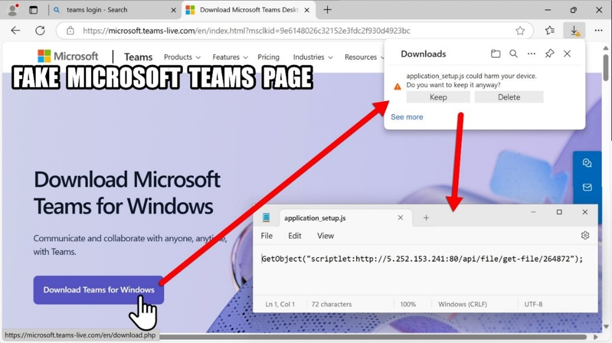
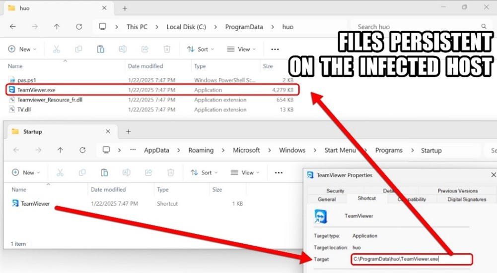

### Hunting with JA4H (HTTP)

Since the initial infection vector is a web page, we start by analyzing HTTP traffic using **JA4H**. In Arkime's SPIView, we look at the distribution of HTTP fields.

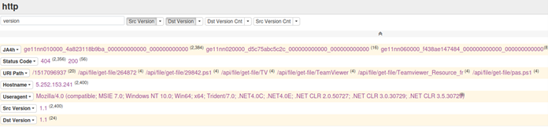
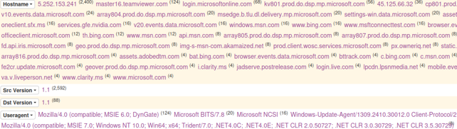

| Anomaly Type   | Finding                                                                 | Implication                                                |
| :------------- | :---------------------------------------------------------------------- | :--------------------------------------------------------- |
| **Hostname** | `Host` header is an IP address (`5.252.153.241`).                        | Non-standard for HTTP/1.1, highly suspicious.              |
| **User-Agent** | `Mozilla/4.0 (compatible; MSIE 6.0; DynGate)`                           | Outdated, non-standard client. Likely a bot, not a user.   |
| **URI** | Path includes calls to `get-file/264872.js` and `get-file/29842.ps1` | Direct download of executable scripts.                     |

We can create a unique fingerprint, `JA4H_ab`, by combining the HTTP method/version with a hash of the headers. This allows us to hunt for this specific bot behavior across our network.

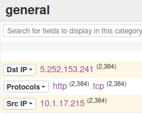

### Hunting with JA4X (Certificates)

Next, we hunt for certificate anomalies.

* **Anomaly (Self-Signed)**: We filter for certificates where the `Issuer` is "Self-signed certificate".
* **Pivot to IPs**: This immediately reveals two malicious IPs: `45.125.66.32` and `45.125.66.252`.
* **Create JA4X Fingerprint**: We can now take the unique JA4X signature of these self-signed certificates (`2bab15409345_2bab15409345_1e0053d9ccd0`) and use it to find other C2 servers using the same certificate template.

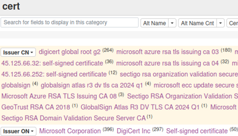

### Combining Signatures for High-Fidelity Detection

The true power of JA4+ is combining these fingerprints. We can build a hunt query that looks for the *combination* of the malicious HTTP behavior **OR** the malicious self-signed certificate.

```
http.ja4h == "ge11nn010000_4a823118b9ba_000000000000_000000000000" || cert.ja4x == "2bab15409345_2bab15409345_1e0053d9ccd0"
```

This query allows us to:

* Detect the initial HTTP-based payload delivery (`JA4H`).
* Detect the subsequent encrypted C2 communication (`JA4X`, `JA4`, `JA4S`).
* Remain effective even if the attacker changes their IP addresses, as the fingerprint is based on *behavior*, not infrastructure.

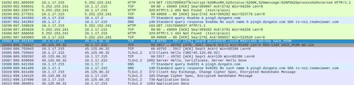

---

## ✅ Conclusion

As attackers increasingly hide within encrypted traffic, traditional IoC-based detection is no longer sufficient. We must focus on the **how** and the **who** by analyzing communication metadata.

### The Advanced Hunting Workflow

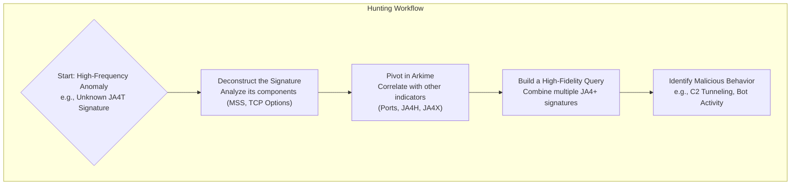
```mermaid
graph TD
    subgraph Hunting Workflow
        HW1{"Start: High-Frequency Anomaly<br>e.g., Unknown JA4T Signature"} --> HW2["Deconstruct the Signature<br>Analyze its components (MSS, TCP Options)"];
        HW2 --> HW3["Pivot in Arkime<br>Correlate with other indicators<br>(Ports, JA4H, JA4X)"];
        HW3 --> HW4["Build a High-Fidelity Query<br>Combine multiple JA4+ signatures"];
        HW4 --> HW5["Identify Malicious Behavior<br>e.g., C2 Tunneling, Bot Activity"];
    end
```

1.  **JA3 is a good start**, but it's brittle and easily evaded through impersonation.
2.  **JA4+ provides a multi-dimensional view** of network traffic, creating fingerprints for TCP, TLS, HTTP, and certificates that are far more resilient to evasion.
3.  **Hunting with JA4+** allows security teams to move from reactive IoC matching to proactive, behavior-based threat hunting. By identifying the unique fingerprints of malicious tools and TTPs, we can detect threats even when they use new infrastructure.
4.  **Tools like Malcolm** are essential for operationalizing this type of analysis, making it possible to quickly pivot from high-level alerts to deep-dive packet investigation.

By embracing this multi-dimensional approach, we can effectively pull back the curtain on encrypted traffic and expose the threats hiding within.
