# 🔬 JA4+ - Identifying Malicious Anomalies in Encrypted Network Traffic

> This guide details the JA4+ suite for identifying sophisticated threats within encrypted traffic. Using the Malcolm analysis tool, we will demonstrate practical, hands-on threat hunting techniques.


---

## 📖 Executive Summary (TL;DR)

This guide provides a practical methodology for hunting malicious actors within encrypted network traffic, moving beyond legacy fingerprinting techniques.

| Concept | Visual Simulation | Description |
| :--- | :--- | :--- |
| **The Problem** | `[Encrypted Traffic 🔒] ---> ❓ <--- [Security 🛡️]` | The vast majority of network traffic is encrypted, creating a significant blind spot for defenders. |
| **Legacy Solution** | `[Attacker 🎭] ---> [JA3 Fingerprint] <--- [Legit App]` | JA3 provides a single fingerprint for TLS clients but is prone to evasion and impersonation. |
| **Modern Solution** | `JA4+ ---> { 🔗 TCP \| 🌐 HTTP \| 📜 Certs \| 🔐 TLS }` | JA4+ offers a suite of multi-layered fingerprints, creating a more resilient and high-fidelity detection capability. |
| **Key Takeaway** | `[Static IoC 🎯] ---> [Behavioral IoA 📈]` | Transition from hunting static artifacts (IPs, hashes) to proactively identifying attacker *behavior* and TTPs. |

---

## 🚀 Why Read This Guide?

This guide is a comprehensive, hands-on journey into modern network threat hunting. By completing it, you will move beyond basic artifact matching and learn to dissect complex, encrypted traffic to uncover sophisticated threats.

| 🧠 You Will Master These Concepts | 🛠️ You Will Use These Tools | 🎯 You Will Gain These Capabilities |
| :--- | :--- | :--- |
| ✅ **Indicators of Compromise (IoCs)**<br>Using static artifacts (IPs, domains, hashes) for initial investigation. | 🔬 **Wireshark & `tshark`**<br>For manual packet inspection and command-line analysis. | 🔎 **Hunt for Static IoCs**<br>Effectively use known-bad lists to find initial footholds. |
| 📈 **Indicators of Attack (IoAs)**<br>Identifying threats by their *behavior*, regardless of their infrastructure. | 🤖 **RITA**<br>To automate the detection of C2 beaconing by analyzing Zeek logs. | 🔄 **Transition from IoC to IoA Hunting**<br>Evolve from reactive artifact hunting to proactive TTP identification. |
| 🔍 **TLS/JA3/JA4+ Fingerprinting**<br>Identifying clients and apps based on their unique network fingerprints. | 🖥️ **The Malcolm Suite**<br>An integrated NTA platform with Zeek, Suricata, and Arkime. | 💥 **Deconstruct Real-World Attacks**<br>Analyze the full attack chain of threats like EMOTET and Cobalt Strike. |
| 🕸️ **Multi-Dimensional Analysis**<br>Combining JA4+, JA4H, and JA4X signatures for high-fidelity detection. | ✍️ **Arkime Query Language**<br>To build powerful, multi-faceted hunt queries. | 🎭 **Unmask Evasive Malware**<br>Write high-fidelity queries to find hidden threats with minimal false positives. |

---

### 🗺️ How Malcolm Empowers Your Hunt

The diagram below illustrates the data flow within a Network Traffic Analysis (NTA) platform like Malcolm. It ingests raw network packets (PCAP), enriches them with metadata (Zeek) and alerts (Suricata), and stores the results in a searchable database (OpenSearch). This enriched data powers the analysis tools (Arkime, Dashboards), transforming raw data into actionable intelligence.

```mermaid
%%{init: {'theme': 'base', 'themeVariables': { 'primaryColor': '#2d333b', 'primaryTextColor': '#adbac7', 'lineColor': '#484f58', 'textColor': '#adbac7', 'mainBkg': '#22272e'}}}%%
graph TD
    A[Raw Packets / PCAP 📦] --> B{Malcolm Data Pipeline 🌀};
    B --> C[Zeek - Metadata Generation 🏷️];
    B --> D[Suricata - IDS Alerts 🚨];
    C --> E[OpenSearch Database 🗄️];
    D --> E;
    E --> F[Arkime - Packet Viewer & Search 🔍];
    E --> G[Dashboards - Visualization 📊];
    subgraph "Analysis & Hunting"
        F;
        G;
    end
    style B fill:#373e47,stroke:#8b949e
```

---

## 📜 Table of Contents

1.  [📦 Sample PCAPs Used in This Guide](#-sample-pcaps-used-in-this-guide)
2.  [💡 Part 1: Theoretical Foundation](#-part-1-theoretical-foundation)
    * [The Challenge of Encrypted Traffic](#the-challenge-of-encrypted-traffic)
    * [What is TLS and JA3/S?](#what-is-tls-and-ja3s)
    * [Weaknesses of JA3](#️-weaknesses-of-ja3)
    * [JA3 vs. JA4+ - The Next Generation](#-ja3-vs-ja4---the-next-generation)
    * [The JA4+ Suite](#the-ja4-suite)
3.  [🕵️ Part 2: Hands-On with JA3 (EMOTET & Cobalt Strike)](#️-part-2-hands-on-with-ja3-emotet--cobalt-strike)
    * [Identifying Malicious Traffic with JA3 IoCs](#identifying-malicious-traffic-with-ja3-iocs)
    * [Basic PCAP Analysis: Identifying Beaconing](#basic-pcap-analysis-identifying-beaconing)
    * [Beacon Analysis with RITA](#beacon-analysis-with-rita)
    * [Certificate Anomaly Analysis](#certificate-anomaly-analysis)
4.  [🖥️ Part 3: Hands-On with Malcolm (EMOTET Mail Spam)](#️-part-3-hands-on-with-malcolm-emotet-mail-spam)
    * [Advanced PCAP Analysis with Malcolm](#advanced-pcap-analysis-with-malcolm)
    * [Investigating with Zeek, Suricata, and Arkime](#investigating-with-zeek-suricata-and-arkime)
    * [Identifying Anomalies in Dashboards](#identifying-anomalies-in-dashboards)
5.  [🚀 Part 4: Advanced Hunting with JA4+](#-part-4-advanced-hunting-with-ja4)
    * [Example: Hunting an Unknown JA4T Signature (Pi Node Miner)](#example-hunting-an-unknown-ja4t-signature-pi-node-miner-19)
    * [Hands-On: Microsoft Teams Phishing Campaign](#hands-on-microsoft-teams-phishing-campaign)
    * [Combining Signatures for High-Fidelity Detection](#combining-signatures-for-high-fidelity-detection)
6.  [✅ Conclusion](#-conclusion)
7.  [📚 Bibliography & References](#-bibliography--references)

---

## 📦 Sample PCAPs Used in This Guide

To follow along with the hands-on examples, you can download the malicious packet captures from their original source at Malware-Traffic-Analysis.net **[1]**.

* **Part 2 (JA3 Hunt)**: **EMOTET with Cobalt Strike**
    * **Source**: [2022-03-24 - Emotet Epoch 4 with Cobalt Strike](https://www.malware-traffic-analysis.net/2022/03/24/index.html)
    * **File**: `2022-03-24-Emotet-epoch4-with-Cobalt-Strike-carved.pcap`
* **Part 3 (Malcolm Hunt)**: **EMOTET Mail Spam**
    * **Source**: [2022-04-20 - Emotet Epoch 4 Infection with Cobalt Strike](https://www.malware-traffic-analysis.net/2022/04/20/index.html)
    * **File**: `2022-04-20-Emotet-epoch4-infection-with-spambot-traffic.pcap`
* **Part 4 (JA4+ Hunt)**: **Microsoft Teams Phishing**
    * **Source**: [2025-01-22 - Fake Microsoft Teams Update Page](https://www.malware-traffic-analysis.net/2025/01/22/index.html)
    * **File**: `2025-01-22-Fake-Microsoft-Teams-update-page-delivers-malware.pcap`

---

## 💡 Part 1: Theoretical Foundation

### The Challenge of Encrypted Traffic

The widespread adoption of TLS/SSL encryption, while essential for privacy, has created a significant blind spot for security monitoring. According to **Google's Transparency Report** [2], over 95% of web pages are now loaded over HTTPS. This means that traditional deep packet inspection (DPI) is no longer viable for threat detection.


Attackers leverage this encryption to conceal their activities. Research from **Zscaler** [3] indicates that over 87% of online threats are now hidden inside encrypted traffic. This reality necessitates a shift in defensive strategy from inspecting *content* to analyzing observable *behavior* and *metadata*. The "Pyramid of Pain" model illustrates this principle [4]: while an attacker can easily change an IP address (a low-value indicator), it is far more difficult to alter the fundamental behavior of their tools and tactics (TTPs), which technologies like JA4+ aim to fingerprint.


### What is TLS and JA3/S?

The TLS protocol uses a handshake process to establish a secure channel. Crucially, the initial phase of this handshake, the `Client Hello` and `Server Hello`, occurs in cleartext. This provides a valuable opportunity for passive observation and fingerprinting.


JA3, developed by **Salesforce** [5], creates a fingerprint from the fields in the `Client Hello` message.

* `JA3`: A fingerprint of the **client's** TLS negotiation parameters.
* `JA3S`: A fingerprint of the **server's** response parameters.

By itself, a JA3 hash can be noisy. The top graph below shows many legitimate programs might use the same generic handshake. But when you combine it with the server's unique response (JA3S), you can pinpoint a specific malicious conversation, as shown in the bottom graph.


| Example Type | Application | JA3 / JA3S Fingerprint                                     |
| :--- | :--- | :--- |
| ✅ **Legitimate** | Tor Browser | `JA3: e7d705a3286e19ea42f587b344ee6865` / `JA3S: a95ca7eab4d47d051a5cd4fb7b6005dc` |
| 😈 **Malicious** | Trickbot    | `JA3: 6734f37431670b3ab4292b8f60f29984` / `JA3S: 623de93db17d313345d7ea481e7443cf` |
| 😈 **Malicious** | Emotet      | `JA3: 4d7a28d6f2263ed61de88ca66eb011e3` / `JA3S: 80b3a14bccc8598a1f3bbe83e71f735f` |

> [!NOTE]
> ### 🕵️‍♂️ Deep Dive: How a JA3 Fingerprint is Made
> <details>
> <summary>Click to expand</summary>
>
> The process involves two simple steps:
>
> **Step 1: Create the JA3 String**
>
> JA3 gathers the decimal values for specific fields from the `Client Hello` and concatenates them into a single string in a precise order: `TLSVersion,Ciphers,Extensions,EllipticCurves,EllipticCurvePointFormats`
>
> 
>
> **Step 2: Hash the String**
>
> This concatenated string is then hashed using **MD5** to produce the final 32-character fingerprint.
> </details>

### ⚠️ Weaknesses of JA3

While revolutionary, JA3 has significant limitations that advanced adversaries exploit. A threat actor can mimic the JA3/S fingerprint for their client/server [6, 7].

The next list shows a collection of legitimate JA3 Fingerprints [8], highlighting how different applications can share the same fingerprint, leading to potential confusion.


> **MITRE ATT&CK® Context: [T1036.005 - Masquerading: Match Legitimate Name or Location](https://attack.mitre.org/techniques/T1036/005/)**
> Adversaries can configure their malware's TLS library to perfectly mimic the JA3 of a common application like Chrome or Firefox, allowing it to blend in with legitimate traffic.

> [!IMPORTANT]
> ### 🤔 Why JA3 Is No Longer Enough
> <details>
> <summary>Click to see the top 3 reasons</summary>
>
> 1.  **🎲 Randomization [9] (GREASE Protocol)**: Modern browsers intentionally add random data to their handshakes (per RFC 8701) to prevent tracking. This means a single legitimate application can produce many different JA3 hashes, creating significant noise.
> 2.  **🎭 Impersonation**: Because the JA3 algorithm is public, an adversary can easily craft their malware to mimic a common application's JA3, a technique known as JA3 masquerading.
> 3.  **💥 Collisions**: Different applications can sometimes, by chance, produce the exact same JA3 hash, leading to false positives.
> </details>

---

### 🚀 JA3 vs. JA4+ - The Next Generation

To address the shortcomings of JA3, FoxIO developed the **JA4+** suite [10]. The goal was to create stronger, more readable, and multi-dimensional fingerprints across various protocols.


### The JA4+ Suite

JA4+ is a collection of signatures for different aspects of a connection, enabling more resilient and context-rich analysis.


This multi-layered approach allows for the creation of detailed fingerprints for specific malware families and tools, as seen in the JA4db database [11]:


It also enables the identification of C2 infrastructure based on certificate fingerprints (JA4X), such as this list of Sliver C2 servers:


Unlike JA3's MD5 hash, JA4+ signatures are human-readable strings. For example, a **JA4T (TCP)** signature looks like this: `JA4T=65535_2-1-3-1-1-4_1460_8`

> [!NOTE]
> ### 🔧 Deep Dive: JA4T Signature Breakdown
> <details>
> <summary>Click to expand</summary>
>
> The JA4T signature is constructed from TCP packet fields:
>
> 
>
> * `65535`: TCP Window Size
> * `2-1-3-1-1-4`: TCP Options (in order)
> * `1460`: TCP Maximum Segment Size (MSS) - This value is derived from the standard Ethernet Maximum Transmission Unit (MTU) of 1500 bytes. The calculation is: `1500 (MTU) - 20 (IP Header) - 20 (TCP Header) = 1460 bytes`. This represents the largest amount of data that can be sent in a single TCP segment.
> * `8`: TCP Window Scale
>
> > **MITRE ATT&CK® Context: [T1592 - Gather Victim Host Information](https://attack.mitre.org/techniques/T1592/)**
> > This modularity allows for nuanced threat hunting. An analyst can associate a specific JA4T signature with an operating system or device type, as different OS stacks build TCP packets differently. This helps to identify anomalous clients on the network and can be a form of passive reconnaissance.
>
> 
> </details>

---

## 🕵️ Part 2: Hands-On with JA3 (EMOTET & Cobalt Strike)

### Identifying Malicious Traffic with JA3 IoCs

In this scenario, we analyze a PCAP where 82% of the traffic is TLS.


**1. Extract JA3 Hashes and IPs:**
Using `tshark`, we extract unique JA3 fingerprints and their corresponding destination IPs.

```bash
# Example tshark command to extract and group JA3 hashes and destination IPs
tshark -r 2022-03-24-Emotet-epoch4-with-Cobalt-Strike-carved.pcap \
  -Y "tls.handshake.type == 1 && tls.handshake.ja3" \
  -T fields -e tls.handshake.ja3 -e ip.dst | \
  sort | uniq -c | \
  awk '{ count=$1; ja3=$2; ip=$3; data[ja3]=data[ja3] "\n  " count " * " ip } END { for (j in data) print j ":" data[j] }'

JA3: 6271f898ce5be7dd52b0fc260d0662b3:
  1 * 195.8.222.36
  1 * 208.113.219.140
JA3: 51c64c77e60f3980eea90869b68c58a8:
  13 * 144.202.49.189
  33 * 70.36.102.35
JA3: 37f463bf4616ecd445d4a1937da06e19:
  37 * 139.60.160.8
```

**2. Check Against Threat Intelligence:**
We cross-reference the extracted IPs and JA3 hashes against IoC databases like Abuse.ch's ThreatFox [12]. This quickly reveals known C2 servers.

* **IP**: `139.60.160.8` -> Known Cobalt Strike C2
* **JA3**: `37f463bf4616ecd445d4a1937da06e19` -> Associated with Cobalt Strike
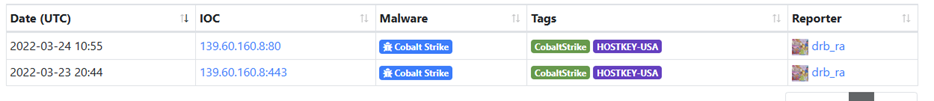

* **IP**: `70.36.102.35` -> Known Emotet C2
* **JA3**: `51c64c77e60f3980eea90869b68c58a8` -> Associated with Emotet


* **IP**: `144.202.49.189` -> Known Emotet C2
* **JA3**: `51c64c77e60f3980eea90869b68c58a8` -> Associated with Emotet
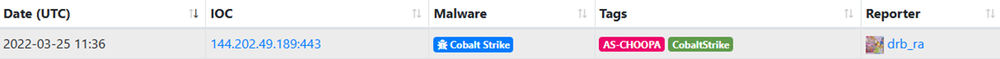

### Basic PCAP Analysis: Identifying Beaconing

#### Basic Hunting Practices

First, we check for suspicious DNS requests to see which domains the host is trying to resolve.

```bash
# Filter for DNS responses and display the query name and resolved IP
tshark -r 2022-03-24-Emotet-epoch4-with-Cobalt-Strike-carved.pcap \
-Y "dns.flags.response == 1 && dns.a" \
-T fields -e dns.qry.name -e dns.a | sort | uniq

cornerstonecreativestudios.com    208.113.219.140
csm101.com                        195.8.222.36
verofes.com                       139.60.160.8
```

Next, we count the number of sessions initiated by our host (`10.3.24.101`) to find the most frequently contacted destinations.

```bash
# Count new TCP sessions (SYN packets) and DNS queries to find top destinations
tshark -r 2022-03-24-Emotet-epoch4-with-Cobalt-Strike-carved.pcap \
-Y '(ip.src == 10.3.24.101) && ((tcp.flags.syn == 1 && tcp.flags.ack == 0) || (dns.flags.response == 0))' \
-T fields -e ip.src -e ip.dst -e _ws.col.Protocol | sort | uniq -c | sort -nr

37  10.3.24.101     139.60.160.8    TCP
33  10.3.24.101     70.36.102.35    TCP
13  10.3.24.101     144.202.49.189  TCP
 8  10.3.24.101     138.197.90.158  TCP
 7  10.3.24.101     10.3.24.4       DNS
 1  10.3.24.101     208.113.219.140 TCP
 1  10.3.24.101     195.8.222.36    TCP
```
This confirms our findings from the JA3 analysis and reveals another suspicious IP: `138.197.90.158`, which ThreatFox identifies as an IcedID C2 server.


Now we can analyze the traffic patterns to these IPs.

> [!WARNING]
> ### 🚨 Threat Detected: C2 Beaconing
> Malware often uses "beaconing"—sending small, regular "heartbeat" packets—to maintain a connection with its Command and Control (C2) server.
>
> **Visualizing the Anomaly:**
> ```
> [Infected Host] --(ping, 1KB)--> [C2 Server]
>      (waits ~11s)
> [Infected Host] --(ping, 1KB)--> [C2 Server]
>      (waits ~11s)
> [Infected Host] --(ping, 1KB)--> [C2 Server]
> ```
>
> **MITRE ATT&CK® Tactic: [T1071 - Application Layer Protocol](https://attack.mitre.org/techniques/T1071/)**
> Adversaries communicate using application layer protocols to avoid detection by blending in with existing traffic. Beaconing is a common implementation of this.

The Wireshark output below clearly shows the repetitive nature of the C2 communication to `139.60.160.8`.


A similar beaconing pattern is observed for the connection to `70.36.102.35`.


> [!TIP]
> ### 🛡️ Defensive Recommendation
>
> * **Monitor Network Behavior (CIS Control 7)**: Continuously monitor network traffic for anomalous patterns like beaconing. Tools like RITA can automate this process.
> * **Filter Outbound Traffic (CIS Control 12.4)**: Implement strict egress filtering rules to block traffic to known malicious IPs and domains.

### Beacon Analysis with RITA

We can automate beacon detection using RITA (Real Intelligence Threat Analytics) [13], which analyzes Zeek logs. RITA's interface highlights the connection to `verofes.com` with a high beaconing score and also flags other suspicious domains.

- You can get started with this framework by setting it up with Docker.
- Also, you need to first get Zeek's logs - I did this also with a Zeek container [14]

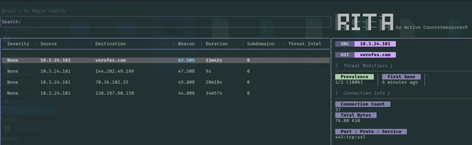

A quick check on ThreatFox confirms that `verofes.com` is a known Cobalt Strike C2 domain.


### Certificate Anomaly Analysis

> [!WARNING]
> ### 🚨 Threat Detected: Suspicious Certificates
> Attackers often use self-signed or fraudulent certificates to encrypt their C2 traffic [15], attempting to masquerade as legitimate TLS traffic.
>
> **Visualizing the Anomaly:**
> A legitimate certificate has a valid chain of trust. A malicious self-signed certificate does not.
> ```
> [Legit Cert] -> Issued by: Trusted CA -> Root CA
> [Malicious Cert] -> Issued by: example.com -> (Self-signed)
> ```
>
> **MITRE ATT&CK® Tactic: [T1587.003 - Acquire Infrastructure: Digital Certificates](https://attack.mitre.org/techniques/T1587/003/)**
> Adversaries may purchase or steal SSL/TLS certificates to further blend in with legitimate traffic and avoid certificate-based warnings.

Running a simple script to check certificate common names against a known Cobalt Strike C2 blacklist immediately flags two domains from our PCAP.

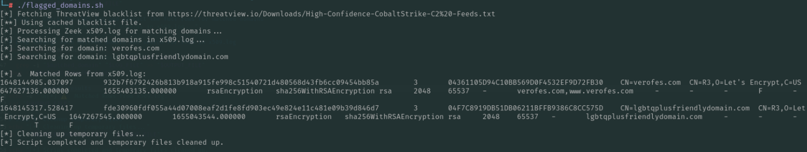

ThreatFox confirms `lgbtqplusfriendlydomain.com` is malicious.


Drilling down in Wireshark reveals the suspicious details within the certificate for `verofes.com`, where the issuer and subject are both `example.com`.


> [!TIP]
> ### 🛡️ Defensive Recommendation
>
> * **Deploy a Network Intrusion Detection System (NIDS) (CIS Control 13.2)**: Use a NIDS like Suricata or Zeek to inspect certificate data in real-time and alert on anomalies.
> * **MITRE ATT&CK® Tactic: [T1608.003 - Stage Capabilities: Digital Certificates](https://attack.mitre.org/techniques/T1608/003/)**: Detecting the use of unusual or self-signed certificates can reveal adversary staging infrastructure.

---

## 🖥️ Part 3: Hands-On with Malcolm (EMOTET Mail Spam)

### Advanced PCAP Analysis with Malcolm

Malcolm is a powerful, open-source **Network Traffic Analysis (NTA)** tool suite [16]. Its strength lies in integrating several best-in-class tools into a single, cohesive platform, allowing analysts to seamlessly pivot between different views of the data.

| Malcolm Component | Role & Strength                                                                                                                                                                                          |
| :--- | :--- |
| **Zeek** 🏷️ | The primary **metadata generator**. Zeek inspects raw traffic and produces high-fidelity, structured logs for dozens of protocols (HTTP, DNS, SSL/TLS, etc.). This turns raw packets into easily searchable events. |
| **Suricata** 🚨 | A high-performance **Intrusion Detection System (IDS)**. Suricata matches traffic against a vast repository of known-bad signatures (rulesets like ET Open) to generate alerts for malware, exploits, and policy violations.      |
| **Arkime** 🔍 | The **full packet capture (FPC)** indexer and viewer. Often called "Wireshark on steroids," Arkime captures and indexes every packet, providing a powerful interface to search, filter, and visualize sessions, and to download the raw PCAP for deep-dive analysis. |
| **OpenSearch** 🗄️ | The **data storage and search engine**. All logs from Zeek and alerts from Suricata are sent to OpenSearch, which provides fast, scalable search and aggregation capabilities, powering all of Malcolm's dashboards. |

We start our investigation in the main **Overview Dashboard**, which gives a high-level summary of the ingested PCAP data.


### Investigating with Zeek, Suricata, and Arkime

**1. Start with the Alerts 🚨**
We move to the **Suricata Alerts** dashboard. We immediately see high-confidence alerts that give us a starting point for our hunt.

* `ET JA3 Hash - [Abuse.ch] Possible Dridex`: 36 hits, pointing to known malicious JA3 fingerprints.
* `ET INFO PE EXE or DLL Windows file download`: Indicates a malicious file was downloaded.

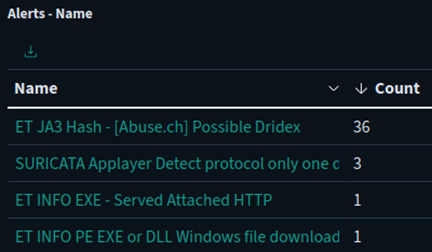

**2. Pivot to Arkime for Context 🔄**
Clicking on an alert in Malcolm pivots us directly into the **Arkime** interface. This provides a detailed view of all related sessions, showing the full context of the communication that triggered the alert. From here we can see the source and destination IPs involved.

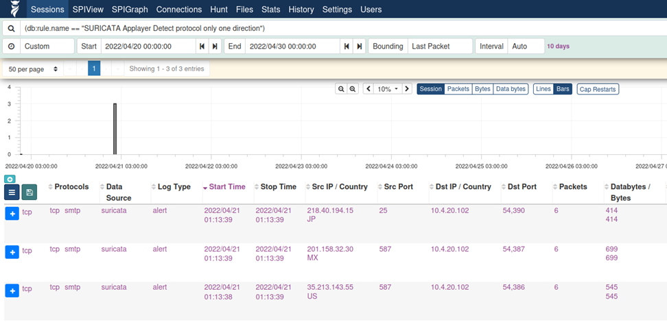

**3. Enrich with Zeek Logs**
We can then use those IPs to filter Zeek logs in Arkime, providing even more metadata about the connections, such as JA3/S hashes, protocols, and file transfers.


### Identifying Anomalies in Dashboards

Malcolm's dashboards allow for rapid anomaly detection by visualizing different aspects of the network traffic.

**Network Connections Graph**
The connection graph for the `Possible Dridex` alert visually confirms that our infected host is communicating with multiple known malicious IPs.


**Malicious File Download**
The `ET INFO EXE – Served Attached HTTP` alert leads us to the exact session where a malicious executable was downloaded.
> **MITRE ATT&CK® Context: [T1204.002 - User Execution: Malicious File](https://attack.mitre.org/techniques/T1204/002/)**
> **CIS Control 9**: Limitation and Control of Network Ports, Protocols, and Services.


- Pivoting to the session metadata in Arkime confirms the details.

    

**Using CommunityID to Correlate Data [17]**
Let's take a suspicious IP from the Zeek Notices dashboard, `49.231.16.102`. By filtering on its unique `CommunityID`, Malcolm can correlate all related logs (Zeek, Suricata, Arkime) for that specific network flow.


- This pivot leads us directly to the Arkime session info, revealing a JA3S hash (`ec74a5c51106f0419184d0dd08fb05bc`) known to be associated with an **IcedID C2 server**.

    

**Connection State Anomalies**
The **Connection State** dashboard reveals a large number of `REJ` (Rejected) and `RSTO` (Reset by other side) connections, indicating scanning activity. This behavior is a strong indicator of reconnaissance or lateral movement attempts.
> **MITRE ATT&CK® Context: [T1046 - Network Service Discovery](https://attack.mitre.org/techniques/T1046/)**
> **CIS Control 7**: Network Monitoring and Defense.

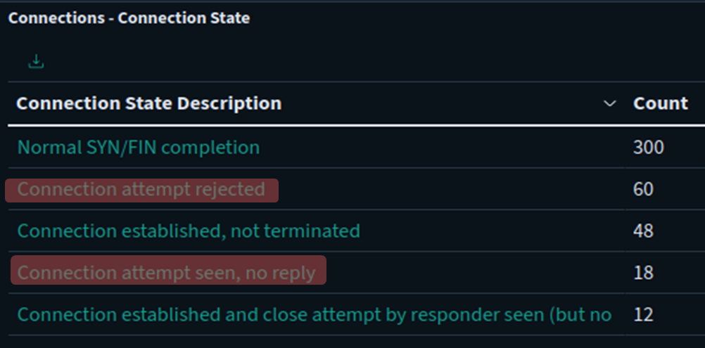

Drilling down into the rejected connections reveals another malicious IP, `185.159.82.20`. Using RITA on the Zeek logs from this PCAP confirms this IP is part of a C2 beaconing pattern, strengthening our confidence in this finding.


**DNS Anomalies**
The **DNS dashboard** visualizes queries by their string randomness (entropy) [18], immediately highlighting algorithmically generated domains (DGAs). DGAs are frequently used by malware to locate C2 servers.

> **MITRE ATT&CK® Context: [T1568.002 - Dynamic Resolution: Domain Generation Algorithms](https://attack.mitre.org/techniques/T1568/002/)**
> **CIS Control 12.5**: Block Unnecessary DNS Traffic.

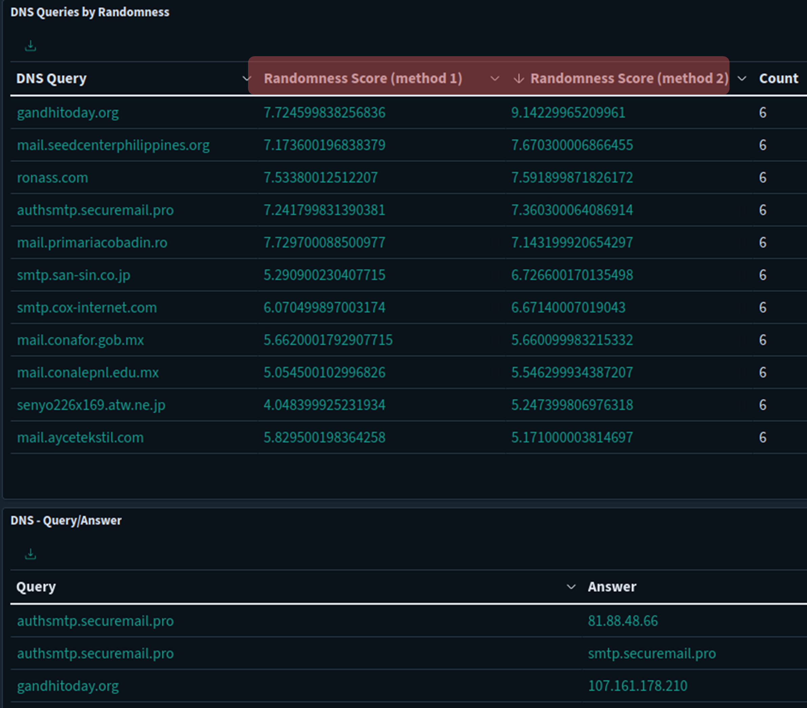

---

## 🚀 Part 4: Advanced Hunting with JA4+

### Example: Hunting an Unknown JA4T Signature (Pi Node Miner [19])

This real-world example demonstrates hunting based on a high-frequency, unknown JA4T signature [20].

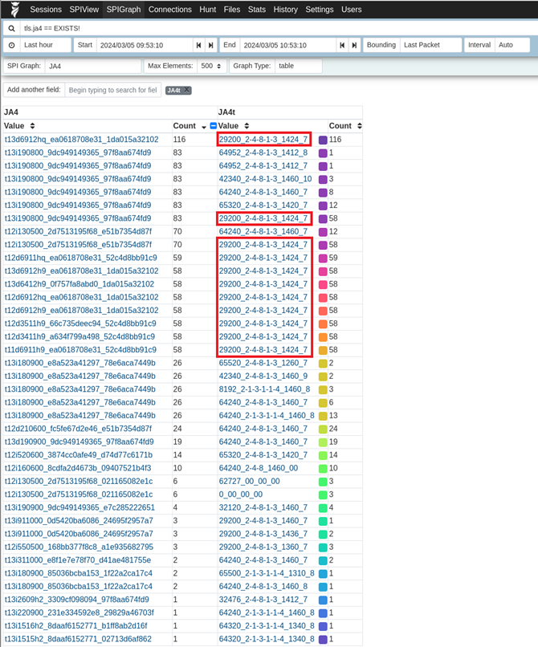

We can infer the Client OS by looking at the JA4T signature:


   - The signature suggests it's a Unix-based system.

> [!WARNING]
> ### 🚨 Threat Detected: Protocol Tunneling
> Adversaries tunneled malicious SSH traffic through the Pi Node cryptocurrency mining network to evade detection. The unique TCP fingerprint (JA4T) of the Pi Node client itself was the key indicator of this abuse.

>
> **Visualizing the Anomaly:**
> ```
> [Attacker] -> [Pi Node Client] --(SSH over Port 443)--> [C2 Server]
> // Legitimate app used as a proxy for malicious traffic
> ```
>
> **MITRE ATT&CK® Tactic: [T1572 - Protocol Tunneling](https://attack.mitre.org/techniques/T1572/)**

The unusual Maximum Segment Size (MSS) of `1424` is a key clue. Here's why it's suspicious:
* **Standard Ethernet MTU**: 1500 bytes
* **IP Header**: 20 bytes
* **TCP Header**: 20 bytes
* **Standard MSS Calculation**: `1500 - (20 + 20) = 1460 bytes`
* **Observed MSS**: `1424 bytes`
* **Difference**: `1460 - 1424 = 36 bytes`

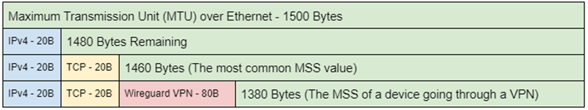

This 36-byte difference is the overhead from an unknown encapsulation protocol. This strongly suggests the traffic is being tunneled through a VPN or proxy [21]. For an attacker, this is a deliberate evasion technique. By routing their traffic through a legitimate application's network (like the Pi Node), they hide the true origin and destination of their C2 communication. The non-standard MSS becomes a critical **Indicator of Attack (IoA)** because it reveals the *behavior* of tunneling, regardless of the IPs or domains used.

- Then we can see the ports associated with this JA4T Fingerprint:


- The traffic is spread across SSH, HTTP, HTTPS, and other ports.
- This information can help define more precise prevention policies.
- By looking at the JA4 and JA4H fingerprints for this traffic, we can see more anomalies:


> ### Decoding the Anomalies: From Fingerprint to TTP
> The real power of JA4+ is translating these cryptic fingerprints into understandable attacker behaviors. Let's break down how the observed signatures reveal the adversary's TTPs in this scenario.
>
> | JA4+ Fingerprint | Observed Anomaly & Translation | Adversary TTP (Indicator of Attack) |
> | :--- | :--- | :--- |
> | **JA4T**<br>`..._1424_...` | **Non-Standard MSS (1424 bytes)**<br>The TCP fingerprint shows a smaller than expected Maximum Segment Size. This isn't random; it's a direct result of an extra layer of encapsulation (36 bytes worth) being added to each packet. | 🎭 **Protocol Tunneling (T1572)**<br>The attacker is hiding their malicious traffic (e.g., SSH) inside the legitimate traffic of another application (Pi Node). This is a deliberate attempt to bypass firewalls and blend in. The MSS anomaly is the smoking gun for this behavior. |
> | **JA4H**<br>`...zh-cn...HTTP/1.0...` | **Unusual Language + Outdated Protocol**<br>The HTTP fingerprint shows a client claiming to be from China (`zh-cn`) using a very old protocol (`HTTP/1.0`) that lacks modern features like ALPN. | 🤖 **Automated Bot Activity**<br>This combination is highly uncharacteristic of a human user with a modern browser. It strongly indicates a non-interactive, automated script or bot designed for wide compatibility, often seen in malware C2 or scanning tools. |
> | **JA4**<br>`t11...` | **Outdated TLS Version (TLS 1.1)**<br>The TLS fingerprint indicates the client is negotiating with TLS 1.1, a protocol that has been deprecated for years due to security vulnerabilities. | 💻 **Use of Outdated/Custom Libraries**<br>Modern operating systems and browsers have moved on to TLS 1.2/1.3. The use of TLS 1.1 suggests the client is either a very old, unpatched system or, more likely, custom malware using a legacy library for its network communications. |
> | **JA4**<br>`...c69...` | **Abnormally High Cipher Suite Count (69)**<br>The client is offering an unusually large number of cipher suites during the TLS handshake. | 💡 **Malware Seeking Compatibility**<br>While a browser might offer 15-20 ciphers, offering 69 is an anomaly. This is often seen in malware that is programmed to be highly flexible, attempting to ensure it can successfully establish a C2 channel with a wide variety of misconfigured or older servers. |

### Hands-On: Microsoft Teams Phishing Campaign

In this scenario, we hunt for a threat that uses a fake Microsoft Teams page to deliver malware [22]. This is a classic example of a multi-stage attack that we can unravel by following the Indicators of Attack (IoAs).

#### 💼 Case File: The Fake Teams Update Incident

---

##### **Phase 1: Initial Compromise (The Lure) 🎣**

The attack begins with a social engineering lure—a fake Microsoft Teams update page. The goal is to trick the user into executing the initial payload.


---

##### **Phase 2: Payload Staging & Execution 📦**

Once the user interacts with the fake page, malware is downloaded and staged on the host. These files are designed to establish persistence and begin C2 communications.


---

##### **Phase 3: Threat Hunting with Malcolm (Following the Trail) 🗺️**

Now, let's put on our analyst hats and use Malcolm's dashboards to find the attacker's footprints.

- **Hunt Starting Point: The Big Picture**
    We begin with the **Security Overview** dashboard. This high-level view immediately gives us our first leads without needing to look at a single packet.

    

- **Lead #1: Suspicious File Transfers (IoA: Malicious File Delivery)**
    The **File Transfers** panel is our first major clue. We see several high-risk file types that are classic malware delivery vectors.

    

| File Type (MIME) | Potential Threat 😈 | Associated Filename(s) | MITRE ATT&CK® Tactic |
| :--- | :--- | :--- | :--- |
| `application/x-dosexec` | Direct Malware Payload | `OfficeActivate.bin`, `MedlaTable.bin` | [T1204.002](https://attack.mitre.org/techniques/T1204/002/) - Malicious File |
| `text/plain` | PowerShell Dropper | (Content for `.ps1` script) | [T1059.001](https://attack.mitre.org/techniques/T1059/001/) - PowerShell |
| `application/vnd.ms-cab-compressed` | Hidden/Archived Malware | (e.g., `.cab` files) | [T1027](https://attack.mitre.org/techniques/T1027/) - Obfuscated Files |
| `application/chrome-ext` | Malicious Browser Extension | (e.g., `.crx` files) | [T1176](https://attack.mitre.org/techniques/T1176/) - Browser Extensions |

- **Lead #2: C2 Heartbeat (IoA: Beaconing Behavior)**
   The **Actions & Results** panel shows a massive number of "404 - Not Found" errors. This is a classic IoA for C2 beaconing. The malware is cycling through a list of potential C2 servers, and most are failing.

    

- **Confirmation: High-Confidence Alerts (Malcolm)**
    The **Suricata - Alerts** dashboard provides high-confidence alerts pointing to the malicious source, and **Zeek Notices** highlights the use of self-signed certificates—a hallmark of attacker-controlled infrastructure.

    
  
    

---

##### **Phase 4: Deep Dive Analysis with Arkime and JA4+ 🕵️‍♀️**

Now we pivot from the high-level dashboards to Arkime to inspect the raw data and apply our JA4+ knowledge.

- **Pivoting to Arkime: IP and Port Anomalies**
    Using the suspicious IPs from Malcolm, we filter in Arkime. The SPI View graph for IP/Port shows a high volume of logs to a single outbound IP using unknown ports, confirming our initial lead.

    

- **HTTP Header Analysis**
    Filtering on HTTP traffic reveals more IoAs:
    - Suspicious GET requests for PowerShell scripts (`.ps1`).
    - The `Host` header contains a raw IP address instead of a domain name.
    - The `User-Agent` string is for `MSIE 6.0`, an ancient browser almost exclusively used by bots.

    
  
    

- **Hunting with JA4H: Decoding the Bot's Signature**
    The JA4H signature `ge11nn010000_4a823118b9ba_000000000000_000000000000` perfectly captures the anomalous HTTP behavior of the malware. Let's decode it:
    
    

    | JA4H Part | Value | Meaning & Anomaly |
    | :--- | :--- | :--- |
    | `JA4H_a` | `ge11nn` | **`ge`**: The client used a **GET** request. <br> **`11`**: The client used **HTTP/1.1**. <br> **`nn`**: **No Cookie** and **No Referer** headers were present. 🕵️‍♂️ This is a huge red flag. Real browsers almost always send these headers. Their absence points to a simple, automated script—not a human user. |
    | `JA4H_b` | `4a82...` | This is a hash of the sorted User-Agent and other headers. In this case, it fingerprints the `MSIE 6.0` user agent, which is highly suspicious. |
    | `JA4H_c` | `0000...` | A hash of the Cookie keys. Since no cookies were sent, this is all zeros. |
    | `JA4H_d` | `0000...` | A hash of the Cookie values. Again, all zeros. |
    
    Filtering on this specific JA4H signature in Arkime isolates the malicious C2 traffic.

    

- **Hunting with JA4X: Unmasking the C2 Infrastructure**
    Next, we hunt for certificate anomalies. A JA4X signature is built from the certificate's subject and issuer information (`JA4X = SHA1(Subject) + "_" + SHA1(Issuer)`).
    
    We find a single JA4X fingerprint, `2bab15409345...`, associated with multiple suspicious IPs. 
    
    

    This is a critical finding! It means the attacker is reusing the same self-signed certificate across their C2 infrastructure. This is a major operational security mistake on their part, and a huge win for us. We can now pivot and hunt for this JA4X hash across our entire network to find other infected hosts or new C2 servers.

    
  
    

- **Pivoting to JA4/S: Completing the Picture**
    Using the JA4X fingerprint, we can find the associated JA4 and JA4S (TLS) fingerprints, giving us yet another layer of indicators to hunt for.

    

### Combining Signatures for High-Fidelity Detection

The true power of JA4+ is combining these fingerprints. We can build a hunt query that looks for the *combination* of the malicious HTTP behavior **OR** the malicious self-signed certificate.

```
http.ja4h == "ge11nn010000_4a823118b9ba_000000000000_000000000000" || cert.ja4x == "2bab15409345_2bab15409345_1e0053d9ccd0"
```
This query allows us to:

* Detect the initial HTTP-based payload delivery (`JA4H`).
* Detect the subsequent encrypted C2 communication (`JA4X`, `JA4`, `JA4S`).
* Remain effective even if the attacker changes their IP addresses, as the fingerprint is based on *behavior*, not infrastructure.


The final Wireshark view shows traffic captured by our combined JA4+ query, successfully identifying the entire attack chain.


---

## ✅ Conclusion

As attackers increasingly hide within encrypted traffic, traditional IoC-based detection is no longer sufficient. We must focus on the **how** and the **who** by analyzing communication metadata.

### The Advanced Hunting Workflow

```mermaid
%%{init: {'theme': 'base', 'themeVariables': { 'primaryColor': '#2d333b', 'primaryTextColor': '#adbac7', 'lineColor': '#484f58', 'textColor': '#adbac7', 'mainBkg': '#22272e'}}}%%
flowchart TD
    A[Start with Anomaly 🕵️<br>e.g., High-frequency JA4T] --> B{Deconstruct Signature 🧩};
    B --> C[Analyze Components<br>- MSS, TCP Options, etc.];
    C --> D{Pivot in Arkime 🔄};
    D --> E[Correlate with other signals<br>- JA4H, JA4X, Ports];
    E --> F[Build High-Fidelity Query 🎯];
    F --> G[Identify Malicious TTP 😈<br>C2 Tunneling, Bot Activity, etc.];
    
    style A fill:#373e47,stroke:#8b949e
    style G fill:#373e47,stroke:#8b949e
```

1.  **JA3 is a good start**, but it's brittle and easily evaded through impersonation.
2.  **JA4+ provides a multi-dimensional view** of network traffic, creating fingerprints that are far more resilient to evasion.
3.  **Hunting with JA4+** allows security teams to move from reactive IoC matching to proactive, behavior-based threat hunting.
4.  **Tools like Malcolm** are essential for operationalizing this type of analysis, making it possible to quickly pivot from high-level alerts to deep-dive packet investigation.

By embracing this multi-dimensional approach, we can effectively pull back the curtain on encrypted traffic and expose the threats hiding within.

---

## 📚 Bibliography & References

1.  **Malware-Traffic-Analysis.net**, "PCAP Repository," [https://www.malware-traffic-analysis.net/](https://www.malware-traffic-analysis.net/)
2.  **Google Transparency Report**, "HTTPS encryption on the web," [https://transparencyreport.google.com/https/overview](https://transparencyreport.google.com/https/overview)
3.  **Zscaler**, "2021 State of Encrypted Attacks Report," [https://www.zscaler.com/resources/infographics/infographic-state-of-encrypted-attacks-2021.pdf](https://www.zscaler.com/resources/infographics/infographic-state-of-encrypted-attacks-2021.pdf)
4.  **Keysight**, "JA3 Randomization," [https://www.keysight.com/blogs/en/tech/nwvs/2024/06/26/ja3-randomization](https://www.keysight.com/blogs/en/tech/nwvs/2024/06/26/ja3-randomization)
5.  **Salesforce Engineering**, "Engineering JA3," [https://github.com/salesforce/ja3](https://github.com/salesforce/ja3)
6.  **CU-Cyber**, "Impersonating JA3 Fingerprints," [https://medium.com/cu-cyber/impersonating-ja3-fingerprints-b9f555880e42](https://medium.com/cu-cyber/impersonating-ja3-fingerprints-b9f555880e42)
7.  **ZenRows**, "What is a TLS Fingerprint," [https://www.zenrows.com/blog/what-is-tls-fingerprint#python](https://www.zenrows.com/blog/what-is-tls-fingerprint#python)
8.  **Salesforce Engineering**, "JA3 Fingerprint Lists," [https://github.com/salesforce/ja3/tree/master/lists](https://github.com/salesforce/ja3/tree/master/lists)
9.  **h-null**, "Sorting Out Randomized TLS Fingerprints," [https://hnull.org/2022/12/01/sorting-out-randomized-tls-fingerprints/](https://hnull.org/2022/12/01/sorting-out-randomized-tls-fingerprints/)
10. **FoxIO**, "JA4+ Network Fingerprinting," [https://blog.foxio.io/ja4+-network-fingerprinting](https://blog.foxio.io/ja4+-network-fingerprinting)
11. **JA4db**, "JA4+ Database," [https://ja4db.com/](https://ja4db.com/)
12. **Abuse.ch**, "ThreatFox IOC Database," [https://threatfox.abuse.ch/](https://threatfox.abuse.ch/)
13. **ActiveCM**, "RITA GitHub Repository," [https://github.com/activecm/rita](https://github.com/activecm/rita)
14. **Docker Hub**, "Official Zeek Image," [https://hub.docker.com/r/zeek/zeek](https://hub.docker.com/r/zeek/zeek)
15. **NCC Group**, "Detecting Anomalous TLS Certificates," [https://www.nccgroup.com/research-blog/encryption-does-not-equal-invisibility-detecting-anomalous-tls-certificates-with-the-half-space-trees-algorithm/](https://www.nccgroup.com/research-blog/encryption-does-not-equal-invisibility-detecting-anomalous-tls-certificates-with-the-half-space-trees-algorithm/)
16. **CISA**, "Malcolm GitHub Repository," [https://cisagov.github.io/Malcolm/](https://cisagov.github.io/Malcolm/)
17. **Malcolm Docs**, "Zeek/Arkime Flow Correlation," [https://malcolm.fyi/docs/arkime.html#ZeekArkimeFlowCorrelation](https://malcolm.fyi/docs/arkime.html#ZeekArkimeFlowCorrelation)
18. **FIRST.org**, "DGA Detection," [https://www.first.org/global/sigs/dns/stakeholder-advice/detection/dga](https://www.first.org/global/sigs/dns/stakeholder-advice/detection/dga)
19. **Pi Network Subreddit**, "Pi Node Port Issue," [https://www.reddit.com/r/PiNetwork/comments/oywudh/port_issue_pi_node/](https://www.reddit.com/r/PiNetwork/comments/oywudh/port_issue_pi_node/)
20. **@4A4133 on X**, "JA4T Tweet," [https://x.com/4A4133/status/1773042080073293827](https://x.com/4A4133/status/1773042080073293827)
21. **Cloudflare Learning Center**, "What is MSS?," [https://www.cloudflare.com/learning/network-layer/what-is-mss/](https://www.cloudflare.com/learning/network-layer/what-is-mss/)
22. **Unit 42 on X**, "Fake Teams Update," [https://x.com/Unit42_Intel/status/1882448037030584611](https://x.com/Unit42_Intel/status/1882448037030584611)
23. **Darktrace Blog**, "Anatomy of a Zero-Day Trojan," [https://www.darktrace.com/blog/anatomy-of-a-zero-day-trojan-caught-by-our-darktrace-appliance](https://www.darktrace.com/blog/anatomy-of-a-zero-day-trojan-caught-by-our-darktrace-appliance)
24. **Kaspersky Resource Center**, "Malicious HTML Attachments," [https://www.kaspersky.com/resource-center/threats/malicious-html-attachments?srsltid=AfmBOoqZI9Mk0ldMEFkyYv_JsKEcAzJgark2z5adBuTOIFLUYGTHc5oO](https://www.kaspersky.com/resource-center/threats/malicious-html-attachments?srsltid=AfmBOoqZI9Mk0ldMEFkyYv_JsKEcAzJgark2z5adBuTOIFLUYGTHc5oO)
25. **Security Stack Exchange**, "OCSP Responders and Malicious Site Blocking," [https://security.stackexchange.com/questions/104890/ocsp-responder-servers-and-malicious-site-blocking](https://security.stackexchange.com/questions/104890/ocsp-responder-servers-and-malicious-site-blocking)
26. **MDPI**, "Applied Sciences Journal," [https://www.mdpi.com/2076-3417/12/8/4088](https://www.mdpi.com/2076-3417/12/8/4088)
27. **Malwarebytes Blog**, "No Money but Pony," [https://www.malwarebytes.com/blog/news/2015/11/no-money-but-pony-from-a-mail-to-a-trojan-horse](https://www.malwarebytes.com/blog/news/2015/11/no-money-but-pony-from-a-mail-to-a-trojan-horse)
28. **ZDNet**, "I Found a Malicious Chrome Extension," [https://www.zdnet.com/article/i-found-a-malicious-chrome-extension-on-my-system-heres-how-and-what-i-did-next/](https://www.zdnet.com/article/i-found-a-malicious-chrome-extension-on-my-system-heres-how-and-what-i-did-next/)
